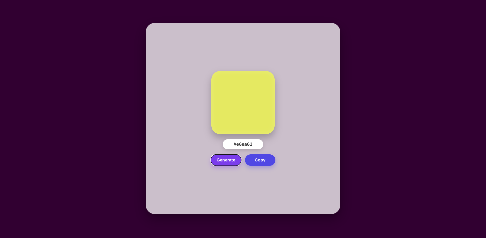
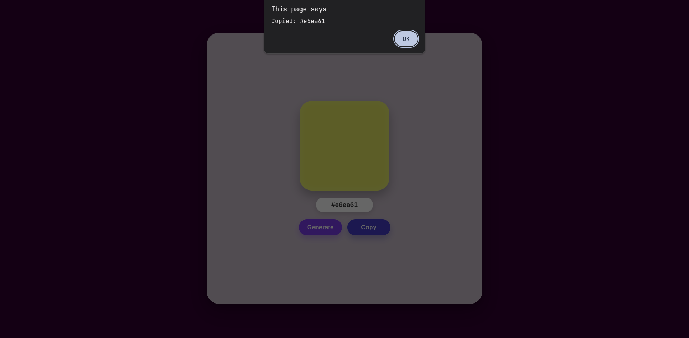

# Random Color Generator

A small front-end project that generates a random hexadecimal color and displays it in a color box. Users can instantly copy the hex code to the clipboard with one click.

## Features

- Generate a random hex color code
- Preview the color in a large square box
- Copy the selected color code to the clipboard
- Clean and modern UI with animated hover effects
- Responsive layout for desktop and mobile screens

## Screenshots

### Generate a random color



### Copy confirmation



## Tech Stack

- HTML
- CSS
- JavaScript

## How to Use

1. Open `index.html` in a browser.
2. Click the "Generate" button to create a new random color.
3. The hex code and color preview will update instantly.
4. Click "Copy" to copy the color value to your clipboard.

## Project Structure

```bash
02_random_color_generator/
├── index.html
├── style.css
├── script.js
├── Generating.png
├── Copied_message.png
└── README.md
```

## Run Locally

Because this is a simple front-end application, you can open the HTML file directly in the browser.

If you prefer a local server, run:

```bash
python3 -m http.server
```

Then open:

```bash
http://localhost:8000
```

## Notes

This project is a fun and beginner-friendly JavaScript exercise that demonstrates random color generation, DOM updates, and clipboard interaction using the browser API.
